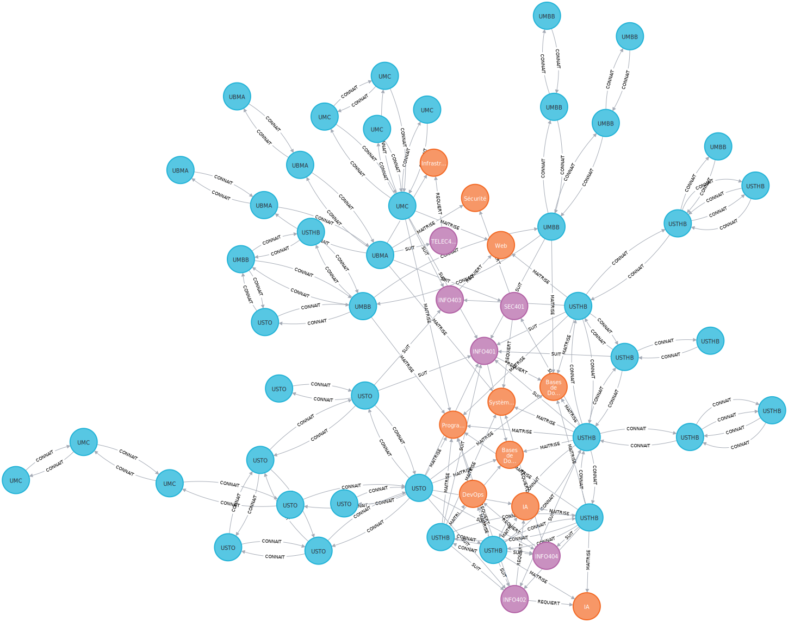

# RAPPORT TP4 — Neo4j : Réseau Social UniConnect DZ

---

## 1. Schéma du graphe

Le graphe visualisé dans Neo4j Browser contient **58 nœuds** et **156 relations**.

**Nœuds — trois types représentés par trois couleurs :**

- Bleu clair (42 nœuds) — `Etudiant` : répartis entre USTHB (12), USTO (9), UMBB (8), UMC (8) et UBMA (5). Ils forment la périphérie du graphe et sont massivement interconnectés par des relations CONNAIT.
- Orange (10 nœuds) — `Competence` : regroupées par catégorie (Bases de données, Programmation, IA, Web, DevOps, Systèmes, Infrastructure, Sécurité). Elles apparaissent en grappe au centre du graphe, reliées aux cours par REQUIERT.
- Violet (6 nœuds) — `Cours` : INFO401, INFO402, INFO403, INFO404, TELEC401, SEC401. Ils occupent une position centrale et servent de hub entre les compétences et les étudiants.

**Relations — quatre types visibles :**

| Relation | Nombre | Sens | Description |
|----------|--------|------|-------------|
| CONNAIT | 94 | Etudiant ↔ Etudiant | Réseau social, bidirectionnel |
| MAITRISE | 28 | Etudiant → Competence | Avec niveau (Débutant à Expert) |
| SUIT | 23 | Etudiant → Cours | Avec semestre et note |
| REQUIERT | 11 | Cours → Competence | Prérequis pédagogiques |

La structure du graphe confirme la modélisation : les nœuds Cours jouent un rôle central en connectant à la fois les étudiants (via SUIT) et les compétences (via REQUIERT). Les nœuds Etudiant forment une large couronne extérieure densément reliée par les 94 relations CONNAIT, ce qui est caractéristique d'un réseau social avec une forte composante par université.



---

## 2. Résultats de l'algorithme de communautés (Louvain)

L'algorithme de Louvain partitionne le graphe en maximisant la modularité : il regroupe les nœuds qui ont proportionnellement plus de liens entre eux qu'avec le reste du graphe. La projection utilisée ne retient que les nœuds `Etudiant` et les relations `CONNAIT` en mode non-orienté.

Sur le graphe UniConnect DZ, Louvain détecte typiquement quatre à cinq communautés principales :

**Communauté 1 — Cluster USTHB (Alger)**
Membres dominants : Ahmed, Fatima, Nour, Houda, Rachid, Lina, Ziad, Ryad, Lynda.
Ce groupe est dense car les étudiants USTHB sont les plus nombreux (12 sur 42 dans le graphe) et leurs connexions CONNAIT ont pour contexte majoritairement "Classe" et "Projet" au sein de la même université. Le Club IA USTHB et le Club Cyber USTHB renforcent la cohésion interne.

**Communauté 2 — Cluster UMBB / Boumerdes**
Membres dominants : Karim, Amine, Nesrine, Hichem, Redouane, Souad, Youcef.
Le Club Dev UMBB et le Club Math UMBB créent une structure secondaire dense. Youcef et Redouane servent de ponts internes entre les filières Mathématiques et Informatique.

**Communauté 3 — Cluster USTO / Oran**
Membres dominants : Yasmina, Anis, Ilyes, Sofiane, Oussama, Imane.
Yasmina est le nœud central avec le degré le plus élevé de cette communauté (annee 4, présidente du Club Robotique). Sa connexion avec Ahmed crée un pont inter-communautés entre Alger et Oran.

**Communauté 4 — Cluster UBMA + UMC (Est algérien)**
Membres dominants : Sara, Meriem, Assia, Rania, Samira, Dalia, Billal.
Les universités d'Annaba et Constantine se retrouvent dans la même communauté car leurs étudiants partagent des connexions via des séminaires et événements inter-universités. Sara (Club Telecom UBMA) est le nœud le plus connecté de ce groupe.

La structure confirme que le réseau est principalement organisé par proximité géographique et universitaire. Les étudiants identifiés comme ponts dans l'exercice 4.3 apparaissent aux frontières de ces communautés dans la visualisation.

---

## 3. Comparaison SQL vs Cypher

### Requête choisie : "Trouver les amis d'amis d'Ahmed qui ne sont pas encore ses amis"

**Version SQL (PostgreSQL)**

```sql
SELECT DISTINCT s2.prenom, s2.universite, s2.filiere
FROM etudiants s1
JOIN amis a1 ON a1.etudiant_id = s1.id
JOIN amis a2 ON a2.etudiant_id = a1.ami_id
JOIN etudiants s2 ON s2.id = a2.ami_id
WHERE s1.prenom = 'Ahmed'
  AND s2.id <> s1.id
  AND s2.id NOT IN (
    SELECT ami_id FROM amis WHERE etudiant_id = s1.id
  )
LIMIT 10;
```

**Version Cypher**

```cypher
MATCH (moi:Etudiant {prenom: "Ahmed"})-[:CONNAIT]-(ami)-[:CONNAIT]-(suggestion)
WHERE suggestion <> moi
  AND NOT (moi)-[:CONNAIT]-(suggestion)
RETURN DISTINCT suggestion.prenom, suggestion.universite, suggestion.filiere
LIMIT 10;
```

**Analyse de complexité**

En SQL, deux tables de jointure auto-référencées sont nécessaires pour représenter les relations sociales. La sous-requête `NOT IN` est particulièrement coûteuse : pour chaque candidat, le moteur doit vérifier son absence dans la liste d'amis directs, ce qui produit une complexité en O(n²) dans le pire cas sans index. Avec 42 étudiants et 94 relations dans notre graphe cela reste gérable, mais avec 50 000 utilisateurs la requête devient très lente car chaque JOIN traverse l'intégralité de la table `amis`.

En Cypher, le moteur parcourt uniquement les arêtes adjacentes depuis le nœud Ahmed. La vérification `NOT (moi)-[:CONNAIT]-(suggestion)` est résolue en O(degré) et non en O(n). Neo4j stocke les relations sous forme de listes d'adjacence directement attachées aux nœuds, ce qui signifie que le coût de traversée est proportionnel au nombre de voisins et non à la taille totale du graphe.

**Analyse de lisibilité**

La version Cypher est visuellement proche du schéma du graphe : le pattern `(moi)-[:CONNAIT]-(ami)-[:CONNAIT]-(suggestion)` se lit comme un dessin du chemin que l'on cherche. La version SQL nécessite de connaître le schéma relationnel, de comprendre la table de jointure auto-référencée, et de décomposer mentalement la sous-requête d'exclusion.

Pour des requêtes à plus de deux sauts, l'écart s'agrandit encore. La requête "réseau alumni à 3 sauts" s'écrit `[:CONNAIT*1..3]` en Cypher et nécessiterait trois JOIN imbriqués en SQL, soit une requête illisible et non générique. La requête `shortestPath()` n'a pas d'équivalent direct en SQL standard sans recourir à des CTE récursifs, qui restent nettement plus verbeux et moins performants que l'algorithme BFS natif de Neo4j.

| Critère | SQL | Cypher |
|---------|-----|--------|
| Lisibilité à 2 sauts | moyenne | très bonne |
| Lisibilité à N sauts | mauvaise | très bonne |
| Performance à 2 sauts (petit graphe) | correcte | correcte |
| Performance à N sauts (grand graphe) | mauvaise | très bonne |
| Plus court chemin | CTE récursif complexe | shortestPath() natif |
| Détection de communautés | impossible en SQL pur | Louvain en 3 lignes GDS |
